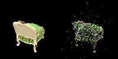
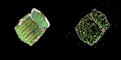
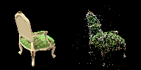
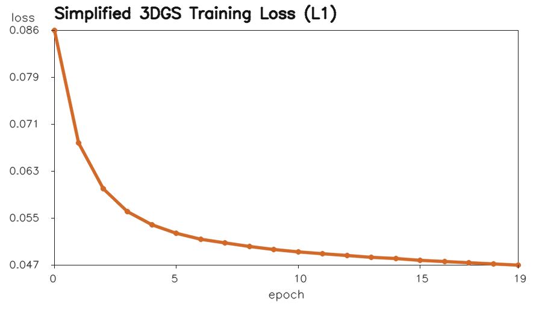
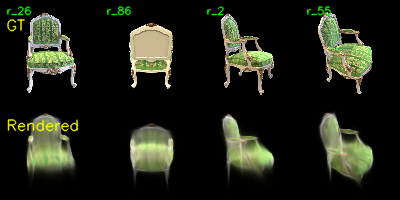
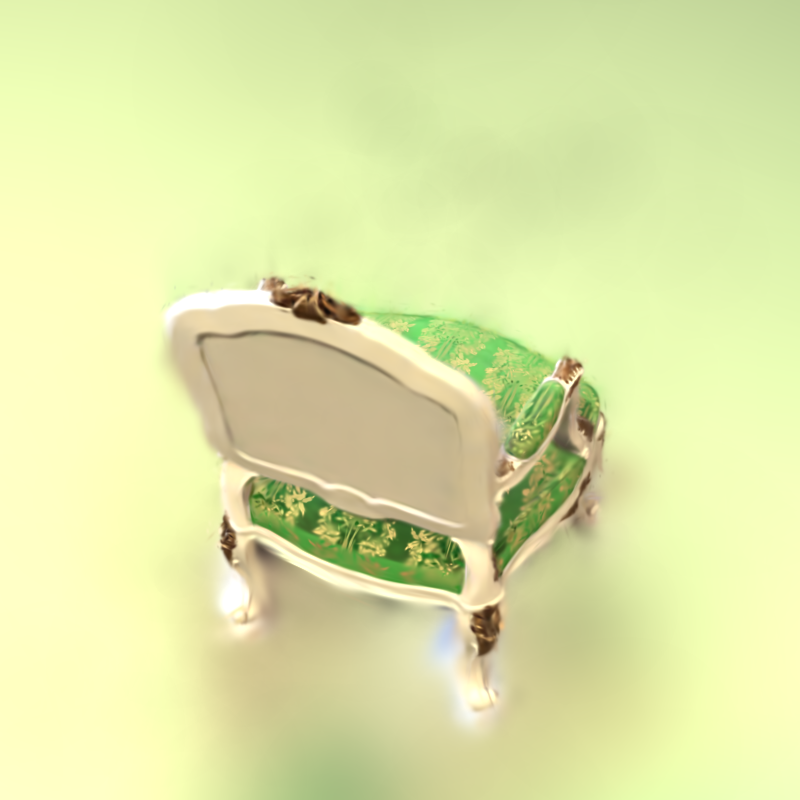

# Assignment 04：简化版 3D Gaussian Splatting 实验报告

席越  
BZ25001010

本次作业完成一个简化版 3D Gaussian Splatting 重建流程。实验以 `chair` 数据为主，先使用 COLMAP 完成 SfM 相机位姿与稀疏点云重建，再补全课程骨架代码中的 PyTorch 渲染核心，包括三维高斯协方差构造、相机投影、二维协方差传播、二维高斯响应计算和 alpha blending。最后将简化实现与官方 3DGS 实现从重建质量、训练速度和显存占用三个方面进行对比。

## Requirements

实验在远程 Windows GPU 环境 `gpu4070` 上完成，作业目录为：

```text
F:\作业\Digital_image_processing\Digital_image_Homework\Assignment_04
```

简化版代码所需依赖列在 `requirements.txt` 中：

```bash
pip install -r requirements.txt
```

主要 Python 依赖如下：

| 依赖 | 用途 |
|---|---|
| `torch` | 高斯参数优化、张量计算与渲染 |
| `numpy` | 数值计算 |
| `opencv-python` | 图像读写与相机投影验证 |
| `natsort` | 图像文件自然排序 |
| `tqdm` | 训练进度显示 |

远程环境中实际使用了两个 Conda 环境：

| 环境 | 用途 |
|---|---|
| `colmap_env` | 运行 COLMAP 3.13.0，完成 SfM 与稀疏点云重建 |
| `gdl_env` | 运行 PyTorch 2.6.0/cu124，完成简化 3DGS 训练、渲染和官方 3DGS 对比 |

官方 3DGS 对比实验使用 `graphdeco-inria/gaussian-splatting`。由于 Windows 上系统 CUDA 11.4 与 PyTorch cu124 不匹配，同时中文路径会导致 MSVC/NVCC 生成 `.obj` 文件失败，因此官方 CUDA 扩展采用 Conda CUDA 12.4 的 `nvcc`，并临时复制到纯英文路径 `D:\official_3dgs_build` 下编译。

## Running

### Task 1：COLMAP 稀疏重建与投影验证

运行 COLMAP 重建：

```bash
conda run -n colmap_env python code/mvs_with_colmap.py --data_dir data/chair
```

运行稀疏点云投影可视化：

```bash
conda run -n gdl_env python code/debug_mvs_by_projecting_pts.py --data_dir data/chair
```

输出包括：

| 路径 | 说明 |
|---|---|
| `data/chair/sparse/0/` | COLMAP 二进制稀疏重建结果，作为生成文件忽略 |
| `data/chair/sparse/0_text/` | 导出的相机、图像和点云文本结果 |
| `data/chair/projections/` | 所有视角的投影验证图，作为生成文件忽略 |
| `pics/colmap_projection_*.png` | 报告中选取的 4 张投影验证图 |

### Task 2：简化版 3DGS 训练

训练命令如下：

```bash
conda run -n gdl_env python code/train.py \
  --colmap_dir data/chair \
  --checkpoint_dir outputs/chair/checkpoints \
  --num_epochs 20 \
  --save_every 5 \
  --debug_every 5 \
  --debug_samples 4 \
  --device cuda \
  --max_points 3000 \
  --downsample_factor 8 \
  --quiet
```

为了避免 8GB 显存环境中直接构造过大的 `N x H x W` 网格，本实验将初始化高斯数量限制为 3000，并对训练图像使用 `downsample_factor=8`。

核心实现包括：

| 文件 | 实现内容 |
|---|---|
| `code/gaussian_model.py` | 使用单位四元数得到旋转矩阵 `R`，使用 `exp(scale)` 得到尺度矩阵 `S`，构造三维协方差 `Cov = (RS)(RS)^T` |
| `code/gaussian_renderer.py` | 实现 COLMAP/OpenCV 相机投影、透视投影 Jacobian、三维到二维协方差传播、二维 Gaussian 计算和前向 alpha blending |
| `code/data_utils.py` | 使用纯 PyTorch 随机固定种子采样替代 PyTorch3D 的 farthest point sampling |
| `code/train.py` | 增加固定随机种子、训练日志、loss CSV、summary、debug image 和轻量化 checkpoint 输出 |
| `code/smoke_test.py` | 对 covariance、projection、renderer 输出做最小单元验证 |

### Task 3：官方 3DGS 对比

官方实现使用同一份 `chair` COLMAP 数据运行 1000 iterations：

```bash
python train.py \
  -s F:\作业\Digital_image_processing\Digital_image_Homework\Assignment_04\data\chair \
  -m F:\作业\Digital_image_processing\Digital_image_Homework\Assignment_04\outputs\official_3dgs\chair_1000 \
  --iterations 1000 \
  --test_iterations 1000 \
  --save_iterations 1000 \
  --checkpoint_iterations 1000 \
  --disable_viewer \
  --quiet
```

渲染命令如下：

```bash
python render.py \
  -m F:\作业\Digital_image_processing\Digital_image_Homework\Assignment_04\outputs\official_3dgs\chair_1000 \
  --iteration 1000 \
  --skip_test \
  --quiet
```

官方完整模型、checkpoint 和完整渲染序列体积较大，不作为提交内容；报告中仅保留 `pics/official_3dgs_render_1000.png` 和轻量文本摘要 `outputs/official_3dgs_summary.txt`。

## Evaluation

本实验从三个层面进行验证：

1. 静态检查：确认代码和报告中没有残留占位符。
2. 单元验证：运行 `smoke_test.py` 检查协方差、投影和渲染输出形状正确且没有 NaN。
3. 端到端验证：确认 COLMAP 重建、投影验证图、简化版训练结果、官方 3DGS 训练和渲染均成功生成。

验证命令：

```bash
conda run -n gdl_env python code/smoke_test.py
```

实际输出：

```text
smoke_test: PASS
```

此外，提交前确认了 README 中引用的所有图片均存在。

## Results

### Task 1 结果：COLMAP 与稀疏点云投影

COLMAP 在 `chair` 数据上成功注册 100 张图像，重建出 13,490 个稀疏三维点。将稀疏点云按照 COLMAP 相机参数重新投影到图像上，可以看到投影点基本覆盖椅子的轮廓和主要结构，说明相机内参、外参和稀疏点云读取正确，可以作为后续 3DGS 初始化。

| 投影验证 1 | 投影验证 2 |
|---|---|
|  |  |

| 投影验证 3 | 投影验证 4 |
|---|---|
|  |  |

### Task 2 结果：简化版 3DGS

简化版模型使用 COLMAP 稀疏点云初始化，并限制为 3000 个 Gaussian。训练 20 个 epoch 后，loss 从约 `0.0863` 下降到 `0.0473`。结果能够恢复出椅子的整体形状和颜色分布，但由于使用纯 PyTorch 的 dense image-grid 渲染，并且没有官方实现中的自适应 densification、tile-based rasterization 和球谐颜色表达，细节和边界仍然较模糊。

| 训练 loss 曲线 | Debug 渲染结果 |
|---|---|
|  |  |

### Task 3 结果：官方 3DGS

官方 3DGS 在相同 `chair` 数据上运行 1000 iterations，最终记录 loss 约为 `0.0256`，生成的点云包含 26,263 个 Gaussian。相比简化版，官方结果结构更清晰、边界更锐利，椅子的几何轮廓和局部颜色细节更稳定。



### 简化版与官方 3DGS 对比

| 对比项 | 简化版 3DGS | 官方 3DGS |
|---|---:|---:|
| 数据集 | `chair`，100 张图像 | `chair`，100 张图像 |
| 初始化方式 | COLMAP 稀疏点云，固定采样到 3000 个 Gaussian | COLMAP 稀疏点云，自适应 densification |
| 训练规模 | 20 epochs | 1000 iterations |
| 最终记录 loss | 0.047307 | 0.025645 |
| 训练耗时 | 780.775 s | 进度条约 28 s，日志墙钟约 35 s |
| 记录显存 | 约 2223.539 MB peak | 运行中观测约 1838 MB |
| 最终 Gaussian 数量 | 3000 | 26263 |
| 渲染方式 | PyTorch dense `N x H x W` 网格计算 | CUDA tile-based rasterizer |
| 颜色表达 | 每个 Gaussian 直接优化 RGB | 球谐系数表达视角相关颜色 |
| 视觉效果 | 能重建整体形状，但较模糊 | 结构更清晰，边缘和纹理更稳定 |

官方实现速度和质量明显更好，主要原因有：

1. 官方使用 CUDA rasterizer 和 tile-based splatting，避免在 Python/PyTorch 中显式构造巨大网格。
2. 官方具有 adaptive densification 和 pruning，可以自动增加高贡献区域的 Gaussian 数量。
3. 官方使用球谐特征表达视角相关颜色，而简化版只优化基础 RGB。
4. 官方包含更多工程优化，例如快速 KNN 初始化、可见性裁剪、压缩排序和更高效的 alpha compositing。

简化版虽然效果弱于官方实现，但代码路径更短，更适合理解 3DGS 的数学流程：从三维高斯协方差出发，经相机投影得到二维高斯，再通过深度排序和 alpha blending 合成图像。

## Notes

- 本次提交不生成 PDF，提交物为 Markdown 实验报告式 `README.md`。
- 大型 checkpoint、官方完整输出、COLMAP database 和完整 projection 文件夹已通过 `.gitignore` 忽略。
- 官方实现的编译问题已解决：使用 Conda CUDA 12.4 的 `nvcc`，并在纯英文路径中编译 CUDA extension，以绕过 Windows 中文路径导致的对象文件生成失败。
- 主实验只使用 `chair`，未将 `lego` 作为必交结果。

## References

- Kerbl et al., 3D Gaussian Splatting for Real-Time Radiance Field Rendering, SIGGRAPH 2023.
- 官方 3DGS 实现：<https://github.com/graphdeco-inria/gaussian-splatting>
- 课程作业骨架：<https://github.com/YudongGuo/DIP-Teaching/tree/main/Assignments/04_3DGS>
- COLMAP 文档：<https://colmap.github.io/>
